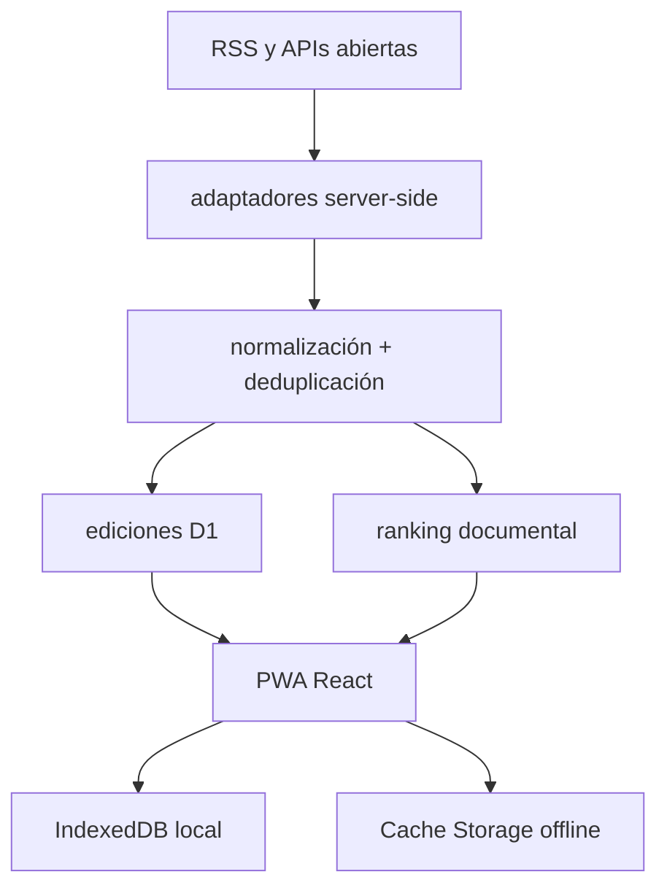

# deriva v2

PWA editorial y documental, mobile-first, para pasar de una edición finita de actualidad a archivos abiertos mediante relaciones explicables. La aplicación no contiene un feed infinito: publica unidades cerradas a las 10:00, 15:00 y 20:00 de Ciudad de México, conserva las anteriores y limita cada sesión de deriva.

## Qué está terminado

- **Ahora:** edición finita de 6–8 acontecimientos, deduplicación, agrupación por evento, diversidad temática, trazabilidad de fuentes, estado de verificación y continuidad entre ediciones.
- **Deriva:** seis operadores con funciones de ranking distintas (`seguir el hilo`, `acercar`, `alejar`, `profundizar`, `cruzar con ahora`, `otra cosa`), semilla determinista, prevención de repeticiones y cierre de sesión configurable.
- **Cruces:** puente visible noticia → entidad/tema → operación/material → objeto documental.
- **Archivo:** IndexedDB versionado, guardados, historial, notas, colecciones, búsqueda, importación/exportación JSON y aprendizaje local borrable.
- **Presentación:** ocho sistemas editoriales seleccionados por tipo de pieza, soporte de imagen/audio/video/PDF, fallback visual y atribución junto al medio.
- **PWA:** manifest completo, iconos `maskable`, Apple touch icon, service worker versionado, cachés separadas, navegación offline y flujo explícito de actualización.
- **Servidor:** adaptadores con timeout, reintento acotado, backoff, circuit breaker, normalización común, caché de borde y snapshots de edición en D1.
- **Seguridad:** APIs externas sólo desde servidor, saneamiento de texto/URL y cabeceras CSP, `nosniff`, `referrer-policy` y `permissions-policy`.

## Arquitectura



`lib/types.ts` define el contrato canónico. `lib/schema.ts` lo valida en las fronteras. `lib/server/` contiene ingestión, adaptadores, resiliencia y persistencia. `lib/engine/` contiene las reglas puras de selección, layout y semántica. `lib/client/db.ts` es la única puerta al archivo local. `components/DerivaApp.tsx` implementa la experiencia accesible. `worker/index.ts` aplica las cabeceras de producción.

## Fuentes

| Estado | Fuentes |
|---|---|
| Adaptador activo, sin clave | Wikimedia Commons, Internet Archive, The Met, Library of Congress, NASA Image and Video Library, Art Institute of Chicago, Cleveland Museum of Art, Wellcome Collection, arXiv |
| Noticias por RSS | BBC Mundo, Noticias ONU, DW Español, EL PAÍS México, Gaceta UNAM, The Guardian, NASA, Dezeen |
| Requiere clave | Europeana, Smithsonian Open Access, DPLA |
| Configurable | Are.na v3 y Public Domain Review |
| Sólo apertura externa | Google Patents; no se presenta como API viva |
| Local | enlaces, JSON y archivos del usuario |

Cada adaptador publica salud, latencia, número de resultados, mensaje y enlace a su documentación. Si una fuente falla, la interfaz conserva la edición y el corpus de reserva verificado; nunca sustituye un fallo por contenido atribuido falsamente.

## Desarrollo

Requiere Node.js 22.13 o posterior.

```bash
npm ci
npm run dev
```

Variables opcionales en `.env.local` (partir de `.env.example`):

```dotenv
EUROPEANA_API_KEY=
SMITHSONIAN_API_KEY=
DPLA_API_KEY=
ARENA_TOKEN=
PUBLIC_DOMAIN_REVIEW_FEED=
```

Ninguna clave llega al navegador. La versión sin claves ya funciona con nueve adaptadores documentales, los feeds de noticias y el archivo local.

## Verificación

```bash
npm run lint
npm run test:unit
npm run test:render
npm run test:e2e
npm run check:budget
```

Las pruebas cubren contrato de contenido, fixtures heterogéneos, normalización RSS/Atom, fecha inválida, ausencia de imagen, deduplicación, reloj editorial, seis operadores, ocho layouts, IndexedDB, importación/exportación, manifest/service worker, render del Worker y recorridos móvil/escritorio. El presupuesto rechaza más de 155 kB gzip entre JS/CSS o un asset superior a 80 kB gzip.

## Ingestión programada

`npm run ingest` genera una instantánea JSON con la edición que corresponde a Ciudad de México. En producción, `GET /api/editions?refresh=1` normaliza las fuentes y guarda la unidad en D1. El workflow `editions.yml` llama ese punto a las 10:00, 15:00 y 20:00 de México (horario estándar UTC−6); el endpoint también puede reconstruir bajo demanda y aplica caché de borde.

## Instalación en iPhone

1. Abre la URL HTTPS en Safari.
2. Toca **Compartir**.
3. Toca **Agregar a pantalla de inicio**; si no aparece, usa **Editar acciones** para añadirla.
4. Activa **Abrir como app** cuando iOS muestre esa opción.
5. Confirma con **Agregar**.

La interfaz incluye la misma guía en el botón `instalar` y detecta cuando ya está en modo standalone.

## Privacidad y límites

Guardados, notas, historial y perfil aprendido permanecen en IndexedDB en el dispositivo. No hay cuenta, analítica ni identificadores publicitarios. Borrar datos del sitio elimina el archivo local; por eso existe exportación JSON.

Los titulares y metadatos remotos pueden cambiar o desaparecer. Las licencias siempre deben confirmarse en la ficha original. Europeana, Smithsonian y DPLA quedan honestamente inactivos sin una clave del operador. Google Patents se abre como búsqueda externa porque no existe una API pública oficial soportada. La versión de reserva evita una pantalla vacía, pero queda rotulada por su procedencia y no simula actualidad en vivo.

## Despliegue

El artefacto de `npm run build` es un Worker ESM compatible con Cloudflare Sites. `.openai/hosting.json` declara D1; las migraciones están en `drizzle/`. El contenido está diseñado para HTTPS, requisito de service workers e instalación PWA.
